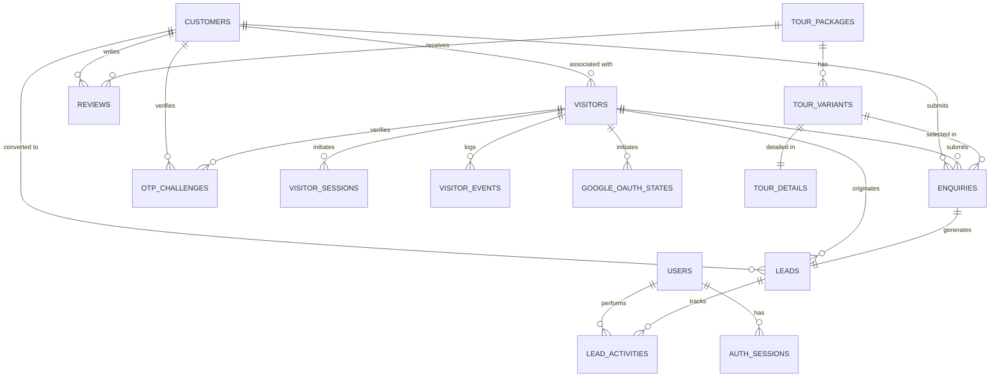

# 🗺️ Coochbehar Travels - Models Context & Architecture Guide

> **System Overview**: Tour Marketing, Web Visitor Telemetry, Leads Pipeline, Accommodations, and Production-Grade Authentication System.

---

## 1. Domain Entities & Database Schema Architecture

---

## 2. Core Model Hierarchy & Base Classes (`app.models.base`)

| Class | Base / Mixins | Purpose | Key Attributes |
| :--- | :--- | :--- | :--- |
| **`Base`** | `DeclarativeBase` | SQLAlchemy declarative root | `metadata` |
| **`UUIDMixin`** | Standalone | Primary Key UUID generator | `id: UUID` (`uuid.uuid4`) |
| **`TimestampMixin`** | Standalone | Server-side timezone-aware audit timestamps | `created_at`, `updated_at` |
| **`IsActiveMixin`** | Standalone | Soft-enable/disable flag | `is_active: bool = True` |
| **`UUIDEntity`** | `Base, UUIDMixin` | Stateless entity with UUID primary key | `id` |
| **`BaseEntity`** | `Base, UUIDMixin, TimestampMixin` | Audited entity with timestamps | `id`, `created_at`, `updated_at` |
| **`ActiveEntity`** | `BaseEntity, IsActiveMixin` | Audited entity with active status | `id`, `created_at`, `updated_at`, `is_active` |

---

## 3. Detailed Model Specifications

### 3.1. Authentication & System Users

#### **`User`** (`app.models.user` → Table: `users`)
- **Inherits**: `ActiveEntity` (`id`, `created_at`, `updated_at`, `is_active`)
- **Fields**:
  - `user_code` (`String(20)`, unique, indexed, non-null): Unique identifier code (e.g., `USR-XXXXXX`).
  - `name` (`String(100)`, non-null): Full legal name of admin/staff.
  - `email` (`String(255)`, unique, indexed, non-null): Work email address used for login.
  - `mobile` (`String(20)`, unique, indexed, non-null): Phone number.
  - `role` (`Enum(UserRole)`: `ADMIN`, `STAFF`, default=`ADMIN`): RBAC role.
  - `profile_pic` (`String(500)`, nullable): Avatar URL (synced from Google or custom).
  - `last_login` (`DateTime(timezone=True)`, nullable): Timestamp of latest successful auth.
- **Relationships**:
  - `lead_activities` (`LeadActivity`, back_populates=`user`): Sales follow-ups logged by this user.
  - `auth_sessions` (`AuthSession`, back_populates=`user`, cascade=`all, delete-orphan`): Server-side refresh sessions.

#### **`AuthSession`** (`app.models.auth_session` → Table: `auth_sessions`)
- **Inherits**: `Base, UUIDMixin` (`id`)
- **Fields**:
  - `user_id` (`UUID`, FK `users.id` ON DELETE CASCADE, indexed, nullable): Owning admin user.
  - `customer_id` (`UUID`, FK `customers.id` ON DELETE CASCADE, indexed, nullable): Owning customer.
  - `actor_type` (`String(20)`, non-null, default=`USER`): `"USER"` or `"CUSTOMER"`.
  - `refresh_token_hash` (`String(255)`, unique, indexed, non-null): SHA-256 cryptographic hash of opaque refresh token.
  - `created_at` (`DateTime(timezone=True)`, server_default=`now()`, non-null): Session initiation timestamp.
  - `last_used_at` (`DateTime(timezone=True)`, server_default=`now()`, non-null): Latest refresh/activity timestamp (used for 24h inactivity check).
  - `expires_at` (`DateTime(timezone=True)`, non-null): Hard absolute session expiration (30 days from original login).
  - `revoked_at` (`DateTime(timezone=True)`, nullable): Revocation timestamp if logged out or rotated.
  - `user_agent` (`String(500)`, nullable): Browser / client user agent string.
  - `ip_address` (`String(45)`, nullable): Client IPv4 or IPv6 address.
- **Relationships**:
  - `user` (`User`, back_populates=`auth_sessions`).
  - `customer` (`Customer`, back_populates=`auth_sessions`).

#### **`Customer`** (`app.models.customer` → Table: `customers`)
- **Inherits**: `BaseEntity` (`id`, `created_at`, `updated_at`)
- **Fields**:
  - `customer_code` (`String(20)`, unique, indexed, non-null): Enduser identifier (e.g., `CUS-XXXXXX`).
  - `name` (`String(100)`, non-null): Customer full name.
  - `mobile` (`String(20)`, indexed, nullable): Primary mobile contact.
  - `email` (`String(255)`, indexed, nullable): Primary contact email.
  - `address` (`String(255)`, nullable): Billing/residential address.
  - `emergency_contact_name` (`String(100)`, nullable).
  - `emergency_contact_mobile` (`String(20)`, nullable).
  - `profile_pic` (`String(500)`, nullable): Customer avatar image URL.
  - `source` (`Enum(LeadSource)`, default=`WEBSITE`): Customer acquisition channel.
  - `is_imported` (`Boolean`, default=`False`): Flag for legacy migrated customers.
- **Relationships**:
  - `visitors` (`Visitor`, back_populates=`customer`): Web tracking profiles linked to this customer.
  - `enquiries` (`Enquiry`, back_populates=`customer`): Tour and custom enquiries.
  - `leads` (`Lead`, back_populates=`customer`): Pipeline leads.
  - `reviews` (`Review`, back_populates=`customer`): Package reviews.
  - `auth_sessions` (`AuthSession`, back_populates=`customer`, cascade=`all, delete-orphan`): Server-side refresh sessions.

---

### 3.2. Temporary Auth & Identity Challenges

#### **`OtpChallenge`** (`app.models.otp_challenge` → Table: `otp_challenges`)
- **Inherits**: `UUIDEntity` (`id`)
- **Fields**:
  - `identifier` (`String(255)`, indexed, non-null): Email or phone number receiving the OTP.
  - `identifier_type` (`String(10)`, non-null): `MOBILE` or `EMAIL`.
  - `otp_hash` (`String(255)`, non-null): Bcrypt/SHA-256 hashed OTP code.
  - `purpose` (`String(30)`, non-null): `LOGIN`, `VERIFY_MOBILE`, `VERIFY_EMAIL`.
  - `attempts` (`Integer`, default=`0`): Number of invalid attempts tried.
  - `max_attempts` (`Integer`, default=`5`): Rate-limit lock threshold.
  - `is_used` (`Boolean`, default=`False`): Single-use consumption flag.
  - `expires_at` (`DateTime(timezone=True)`, non-null): Expiration cutoff (typically 5 mins).
  - `created_at` (`DateTime(timezone=True)`, server_default=`now()`, non-null).
  - `verified_at` (`DateTime(timezone=True)`, nullable).
  - `visitor_id` (`UUID`, FK `visitors.id` ON DELETE SET NULL, nullable).
  - `customer_id` (`UUID`, FK `customers.id` ON DELETE SET NULL, nullable).

#### **`GoogleOAuthState`** (`app.models.google_oauth_state` → Table: `google_oauth_states`)
- **Inherits**: `UUIDEntity` (`id`)
- **Fields**:
  - `state_token` (`String(255)`, unique, indexed, non-null): CSRF token for Google OAuth redirection.
  - `purpose` (`String(30)`, non-null): `ADMIN_LOGIN`, `CUSTOMER_LOGIN`, `CUSTOMER_LINK`.
  - `redirect_uri` (`Text`, nullable): Callback target URI.
  - `visitor_id` (`UUID`, FK `visitors.id` ON DELETE SET NULL, nullable).
  - `expires_at` (`DateTime(timezone=True)`, non-null): 5-minute TTL.
  - `created_at` (`DateTime(timezone=True)`, server_default=`now()`, non-null).
  - `is_used` (`Boolean`, default=`False`).

---

### 3.3. Web Visitor Telemetry & Analytics

#### **`Visitor`** (`app.models.visitor` → Table: `visitors`)
- **Inherits**: `UUIDEntity` (`id`)
- **Fields**: `visitor_code`, `fingerprint`, `ip_address`, `country`, `state`, `city`, `browser`, `os`, `device`, `lead_score`, `first_seen`, `last_seen`, `customer_id` (FK `customers.id`).
- **Relationships**: `customer`, `sessions`, `events`, `enquiries`, `leads`.

#### **`VisitorSession`** (`app.models.visitor_session` → Table: `visitor_sessions`)
- **Inherits**: `UUIDEntity` (`id`)
- **Fields**: `session_code`, `visitor_id` (FK `visitors.id`), `landing_page`, `exit_page`, `referrer`, `utm_source`, `utm_medium`, `utm_campaign`, `utm_term`, `page_views`, `duration_seconds`, `started_at`, `ended_at`.

#### **`VisitorEvent`** (`app.models.visitor_event` → Table: `visitor_events`)
- **Inherits**: `UUIDEntity` (`id`)
- **Fields**: `event_code`, `visitor_id` (FK `visitors.id`), `session_id` (FK `visitor_sessions.id`), `event_name`, `page`, `metadata` (`JSONB`), `created_at`.

---

### 3.4. Tour Catalog & Marketing

#### **`TourPackage`** (`app.models.tour_package` → Table: `tour_packages`)
- **Inherits**: `ActiveEntity` (`id`, `created_at`, `updated_at`, `is_active`)
- **Fields**: `tour_code`, `slug` (unique), `title`, `destination`, `type` (`DOMESTIC`/`INTERNATIONAL`), `description`, `is_featured`.
- **Relationships**: `variants` (`TourVariant`), `reviews` (`Review`), `enquiries` (`Enquiry`).

#### **`TourVariant`** (`app.models.tour_variant` → Table: `tour_variants`)
- **Inherits**: `ActiveEntity` (`id`, `created_at`, `updated_at`, `is_active`)
- **Fields**: `package_id` (FK `tour_packages.id`), `variant_code`, `name`, `season_name`, `valid_from`, `valid_to`, `duration_days`, `duration_nights`, `base_price`, `seats`, `is_default`, `key`, `display_order`, `badge`, `season_type`, `currency`, `availability`.
- **Relationships**: `package`, `details` (`TourDetail`), `enquiries`.

#### **`TourDetail`** (`app.models.tour_detail` → Table: `tour_details`)
- **Inherits**: `Base` (Primary key is `variant_id` FK `tour_variants.id` + `id: UUID`)
- **Fields**: `variant_id`, `tour_detail_code`, `banner` (`JSONB`), `gallery` (`JSONB`), `highlights` (`JSONB`), `inclusions` (`JSONB`), `exclusions` (`JSONB`), `departures_dates` (`JSONB`), `itinerary` (`JSONB`), `route_stops` (`JSONB`).

---

### 3.5. Enquiries, Leads & Accommodations

#### **`Enquiry`** (`app.models.enquiry` → Table: `enquiries`)
- **Inherits**: `BaseEntity`
- **Fields**: `enquiry_code`, `visitor_id`, `customer_id`, `enquiry_type` (`FIXED_TOUR`, `CUSTOM_TOUR`, etc.), `channel` (`WEBSITE`, `WHATSAPP`, `PHONE`, etc.), `status` (`NEW`, `IN_PROGRESS`, `QUOTED`, `CONVERTED`, `CANCELLED`, `CLOSED`), `package_id`, `variant_id`, `subject`, `message`, `room_id`, `vehicle_id`, `destination`, `travel_date`, `travel_duration`, `pax_no`, `no_room`, `vehicle_type`, `meal_plan`, `special_requirements`.

#### **`Lead`** (`app.models.lead` → Table: `leads`)
- **Inherits**: `BaseEntity`
- **Fields**: `lead_code`, `customer_id`, `enquiry_id` (FK `enquiries.id` UNIQUE), `visitor_id`, `full_name`, `mobile`, `email`, `whatsapp_opt_in`, `lead_score`, `status` (`NEW`, `CONTACTED`, `FOLLOW_UP`, `QUALIFIED`, `CONVERTED`, `LOST`), `source`, `notes`, `last_contacted_at`.

#### **`LeadActivity`** (`app.models.lead_activity` → Table: `lead_activities`)
- **Inherits**: `BaseEntity`
- **Fields**: `lead_id` (FK `leads.id`), `user_id` (FK `users.id`), `channel`, `activity_type`, `notes`, `next_follow_up_at`.

#### **`Review`** (`app.models.review` → Table: `reviews`)
- **Inherits**: `BaseEntity`
- **Fields**: `review_code`, `package_id`, `customer_id`, `name`, `rating` (1-5), `review`, `is_verified`, `is_published`.

#### **`Room`** & **`Vehicle`**
- `Room`: `room_code`, `room_number`, `room_type`, `capacity`, `price_per_night`, `description`, `is_active`.
- `Vehicle`: `vehicle_code`, `name`, `registration_number`, `capacity`, `price_per_day`, `is_active`.

---

## 4. Authentication & Session Lifecycles

### Token Specifications
1. **Access Token (JWT)**:
   - Header: `{"alg": "HS256", "typ": "JWT"}`
   - Claims: `{"sub": "<user_id>", "role": "<role>", "email": "<email>", "type": "access", "exp": <15 min unix>}`
   - Sent: Authorization header `Bearer <token>` (kept in frontend memory).
2. **Refresh Token (Opaque)**:
   - Format: `secrets.token_urlsafe(64)` (high entropy random string).
   - Stored in DB: SHA-256 hash in `auth_sessions.refresh_token_hash`.
   - Sent to Client: `HttpOnly`, `Secure`, `SameSite=Lax`, `Path=/` cookie.
   - Lifetime: 30 days absolute (`expires_at`), invalidated after 24 hours of inactivity (`last_used_at`).
   - Rotation: Rotated upon every refresh call; old token is marked revoked; reused old tokens trigger immediate revocation of all user sessions (theft protection).
